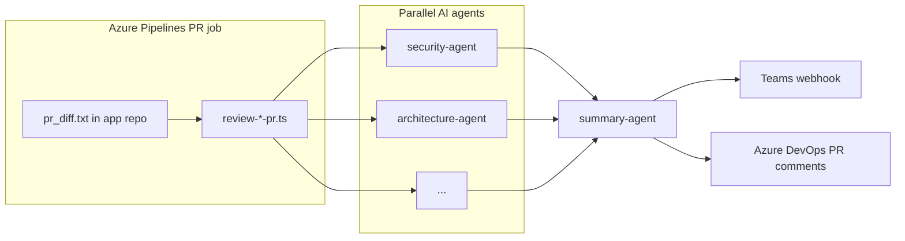

# AI Code Pilot

AI Code Pilot is an automated pull request review tool for **Azure DevOps**. It runs one or more specialist AI agents against a PR diff, merges their output with a summary agent, then publishes results to:

- **Microsoft Teams** (Incoming Webhook card)
- **Azure DevOps** (one general PR comment plus inline review threads where file and line are known)

The tool is designed to run as a **separate repository** checked out beside your application repo in an Azure Pipelines PR validation job. Your app pipeline supplies `pr_diff.txt`; this repo supplies the review logic, prompts, and publishing code.

---

## How it works



1. **Diff input** — A unified diff for the PR is written to `pr_diff.txt` at the root of the application repository (`BUILD_SOURCESDIRECTORY`).
2. **Agent selection** — Depending on which entry script you run, one or more agents receive only the diff hunks that match their file rules (see [Agents](#agents)).
3. **AI call** — Each agent calls your configured model endpoint (`AISettings.json`) with a composed prompt (system + agent + diff).
4. **Summary** — The summary agent receives all agent JSON results and produces a single executive review.
5. **Publish** — Teams notification and Azure comments run afterward; failures in publishing are logged but do not fail the review step unless the main script throws earlier.

---

## Repository layout

| Path | Purpose |
|------|---------|
| `scripts/review-dev-pr.ts` | Main entry for application PRs (development agents + optional DevOps agent) |
| `scripts/review-automation-pr.ts` | Test/automation PRs (`automation-agent` only) |
| `scripts/review-infra-pr.ts` | Legacy alias; runs the same logic as `review-dev-pr.ts` |
| `scripts/verify-azure-pr-comment.ts` | Smoke-test Azure DevOps comment API (general or inline) |
| `scripts/send-TeamsNotification.ts` | Teams card builder used after review |
| `config/agents.ts` | Which agents belong to dev / automation / infra groups |
| `config/agent-file-rules.ts` | File extensions and paths each agent sees in the diff |
| `prompts/agents/*.md` | Per-agent review instructions |
| `prompts/system/base-system.md` | Shared reviewer rules (line numbers, snippets, tone) |
| `prompts/templates/` | Prompt assembly templates |
| `services/` | Diff parsing, prompt building, AI HTTP client, JSON parsing |
| `publishComments/` | Azure DevOps threads, line mapping, comment formatting |
| `AISettings.json` | Model endpoint, deployment name, API key |
| `ExecutionSettings.json` | Teams webhook URL, Azure DevOps PAT (often token-substituted in CI) |

---

## Agents

Agents are defined in `config/agents.ts` and filtered by `config/agent-file-rules.ts`.

### Development PRs (`review-dev-pr.ts`)

Always runs:

| Agent | Typical scope |
|-------|----------------|
| `security-agent` | All changed files (`*`) |
| `architecture-agent` | All changed files (`*`) |
| `performance-agent` | `.cs`, `.sql`, `.ts`, `.tsx`, `.js`, `.cshtml` |
| `ui-agent` | `.tsx`, `.jsx`, `.css`, `.scss`, `.sass`, `.html`, `.cshtml`, `.svg`, `.js`, `.ts` — unified React + frontend reviewer (replaces former `react-agent` + `frontend-agent`) |
| `dotNet-agent` | `.cs`, `.csproj`, `.sln`, `.config` |

**Additionally**, if the diff contains DevOps-related paths (`.yml`, `Dockerfile`, `.tf`, etc.), `devops-agent` is included automatically. You do not need a separate infra pipeline job unless you want different scheduling.

### Automation PRs (`review-automation-pr.ts`)

Runs `automation-agent` only (Playwright/Cypress-style tests, `.feature`, `.spec.ts`, etc.).

### Summary

Every flow ends with `summary-agent`, which consolidates agent outputs into one structured result (`deploymentReadiness`, `findings`, etc.).

### Customizing agents

1. Add or edit `prompts/agents/<agent-name>.md`.
2. Register the agent in `config/agents.ts` (appropriate array).
3. Add file rules in `config/agent-file-rules.ts`.
4. Ensure your review script includes that agent group.

---

## Configuration

### `AISettings.json` (required for AI calls)

| Field | Description |
|-------|-------------|
| `AIModelEndpoint` | Full HTTPS URL for chat/completions (or compatible API). Azure OpenAI example: `https://<resource>.openai.azure.com/openai/deployments/<deployment>/chat/completions?api-version=2024-02-15-preview` |
| `AIModelKey` | API key sent as `api-key` header |
| `ModelName` or `ModelDeploymentName` | Model or deployment id in the request body |
| `ModelTemperature` | Sampling temperature (default `0.2`) |

Do not commit real keys to source control. In pipelines, use **File Transform** or a secure variable group to populate this file at deploy time.

### `ExecutionSettings.json` (Teams + Azure comments)

| Field | Description |
|-------|-------------|
| `TeamsWebHooksURL` | Microsoft Teams Incoming Webhook URL. If empty, the Teams step fails gracefully (logged, review still completes). |
| `AZURE_DEVOPS_PAT` | Personal Access Token with permission to comment on pull requests. Use pipeline **FileTransform@2** to substitute `$(AZURE_DEVOPS_PAT)` from a secret variable. |

### Environment variables

**Azure Pipelines (usually set automatically on PR builds)**

| Variable | Used for |
|----------|----------|
| `BUILD_SOURCESDIRECTORY` | Application repo root; location of `pr_diff.txt` |
| `BUILD_REPOSITORY_NAME` | Repo name in prompts and Teams card |
| `BUILD_REPOSITORY_ID` | Azure DevOps repository id |
| `SYSTEM_TEAMPROJECT` | Project name |
| `SYSTEM_TEAMFOUNDATIONCOLLECTIONURI` / `SYSTEM_COLLECTIONURI` | Organization URL |
| `SYSTEM_PULLREQUEST_PULLREQUESTID` | PR id for comments and links |
| `SYSTEM_PULLREQUEST_PULLREQUESTNUMBER` | Display number in Teams title |

**Optional overrides**

| Variable | Purpose |
|----------|---------|
| `AI_CODE_PILOT_ROOT` | Root of this tool repo when not inferred from script location |
| `EXECUTION_SETTINGS_PATH` / `AZURE_DETAILS_PATH` | Explicit path to `ExecutionSettings.json` |
| `AI_CODE_PILOT_VERBOSE` | Set to `true` to log full AI HTTP responses |
| `AI_CODE_PILOT_ALLOW_BUILD_TOKEN` | Set to `true` to use `SYSTEM_ACCESSTOKEN` instead of PAT (requires **Contribute to pull requests** on the build identity) |
| `AZURE_DEVOPS_ORGANISATION` / `AZURE_DEVOPS_ORGANIZATION_URL` / `AZURE_DEVOPS_PROJECT` | Override org/project when not on an agent |
| `AZURE_DEVOPS_PULL_REQUEST_ID` | Override PR id |
| `TeamsWebHooksURL` | Override webhook without editing JSON |

**Verify script only**

| Variable | Purpose |
|----------|---------|
| `VERIFY_COMMENT_TEXT` | Text for test comment |
| `VERIFY_FILE_PATH` | File path for inline test (default `/pages/UI/taskspage.pom.ts`) |
| `VERIFY_LINE` | Line number for inline test (default `62`) |

---

## Azure Pipelines integration

This repository does not contain your application pipeline YAML. A typical PR job does the following:

1. Check out the **application** repository (self).
2. Check out **AI Code Pilot** (this repo) into a subfolder, e.g. `ai-code-pilot/`.
3. Produce a unified diff at `$(Build.SourcesDirectory)/pr_diff.txt` (e.g. `git diff` against the PR target branch).
4. Transform `AISettings.json` and `ExecutionSettings.json` with secrets.
5. Run the appropriate review script with `AI_CODE_PILOT_ROOT` pointing at the tool folder.

Example step (development PR):

```yaml
- checkout: self
- checkout: ai-code-pilot
  path: ai-code-pilot

# ... step that writes pr_diff.txt to $(Build.SourcesDirectory) ...

- task: FileTransform@2
  inputs:
    folderPath: '$(Pipeline.Workspace)/ai-code-pilot'
    jsonTargetFiles: 'AISettings.json,ExecutionSettings.json'

- script: |
    cd "$(Pipeline.Workspace)/ai-code-pilot"
    npx ts-node scripts/review-dev-pr.ts
  displayName: 'AI Code Pilot — development PR review'
  env:
    AI_CODE_PILOT_ROOT: '$(Pipeline.Workspace)/ai-code-pilot'
```

Use `scripts/review-automation-pr.ts` for test-only repositories or jobs focused on automation code.

**Permissions for Azure comments**

- Preferred: PAT in `ExecutionSettings.json` with **Pull Request Threads** / comment scope.
- Alternative: `AI_CODE_PILOT_ALLOW_BUILD_TOKEN=true` and grant the **Project Collection Build Service** (or your job identity) **Contribute to pull requests** on the repo.

---

## Local setup

### Prerequisites

- Node.js 18+ (LTS recommended)
- npm

### Install

```bash
git clone <this-repo-url>
cd ai_code_review
npm install
```

### Configure

1. Copy and fill `AISettings.json` with your endpoint, key, and deployment name.
2. Copy and fill `ExecutionSettings.json` with Teams webhook and PAT (for local Azure tests).

### Prepare a diff

Place a unified diff at the repo root as `pr_diff.txt`, or set `BUILD_SOURCESDIRECTORY` to the folder that contains it:

```bash
# Example: diff of current branch vs main (run from your app repo, then copy file here)
git diff origin/main...HEAD > pr_diff.txt
```

### Run a review

```bash
# Development-style review (default)
npx ts-node scripts/review-dev-pr.ts

# Automation / test PRs
npx ts-node scripts/review-automation-pr.ts
```

On a local machine without Azure Pipelines env vars, **AI review still runs**, but Azure PR comments are skipped unless you set org/project/repo/PR variables and a PAT (see `publishComments/load-azure-config.ts`).

### Verify Azure DevOps comments

```bash
# Inline comment test
npx ts-node scripts/verify-azure-pr-comment.ts

# General PR comment only
npx ts-node scripts/verify-azure-pr-comment.ts --general
```

Set `SYSTEM_TEAMPROJECT`, `BUILD_REPOSITORY_NAME`, `SYSTEM_PULLREQUEST_PULLREQUESTID`, collection URI, and `AZURE_DEVOPS_PAT` (or pipeline token with `AI_CODE_PILOT_ALLOW_BUILD_TOKEN=true`).

---

## AI response format

Agents must return JSON matching `models/ai-review-result.ts`:

- `agent`, `summary`, `deploymentReadiness` (`BLOCKED` | `HIGH_RISK` | `MEDIUM_RISK` | `LOW_RISK` | `READY`)
- `findings[]` with `severity`, `category`, `file`, optional `line`, `title`, `explanation`, `recommendation`

Findings with valid `file` and `line` (on the PR **right-hand** side of the diff) become **inline** Azure DevOps threads. Others appear only in the **summary** comment and Teams card.

---

## Troubleshooting

| Symptom | What to check |
|---------|----------------|
| `AI endpoint missing` / `Invalid URL` | `AIModelEndpoint` in `AISettings.json` is a full `https://` URL after File Transform |
| `AI API key missing` | `AIModelKey` is set and not a literal `$(Variable)` placeholder |
| `PR comments skipped` | PAT, PR id, project, and repo env vars; run with `AI_CODE_PILOT_VERBOSE=true` |
| `AZURE_DEVOPS_PAT looks unsubstituted` | FileTransform@2 did not run or variable name mismatch |
| No inline comments, summary only | Findings missing `line`, or line not on PR diff right side; check agent prompts in `base-system.md` |
| Teams failed, review OK | Empty or invalid `TeamsWebHooksURL`; errors are caught in `run-after-review.ts` |
| Build identity cannot comment | Use PAT in `ExecutionSettings.json` or grant build service PR contribute + `AI_CODE_PILOT_ALLOW_BUILD_TOKEN=true` |

---

## Security notes

- Treat `AISettings.json` and `ExecutionSettings.json` as **secrets in CI**; use variable groups and File Transform.
- Do not commit PATs, API keys, or webhook URLs.
- `send-TeamsNotification.ts` uses `rejectUnauthorized: false` on HTTPS for some corporate proxies; be aware if you harden TLS in your environment.

---

## Contributing

When adding a new agent:

1. Create `prompts/agents/<name>.md`.
2. Add rules to `config/agent-file-rules.ts`.
3. Register in `config/agents.ts`.
4. Wire into the correct `review-*-pr.ts` flow (or extend `review-dev-pr.ts` selection logic).
5. Document the agent in this README under [Agents](#agents).

---

## License

ISC (see `package.json`).
